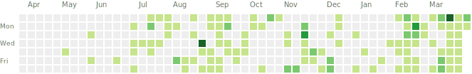

# 👋 Hi there! I'm Mukul Prasad

## 🤖 AI/ML Enthusiast & CS Sophomore at MSRIT, Bengaluru

Just pushing some things that I build.

---   

okay so,
🌐 **Portfolio:** [mukulprasad.netlify.app](https://mukulprasad.netlify.app)  
🔗 **All Social Links:** https://mukul.taplink.in

Now,
### 💻 Technical Skills

**Programming & Development:**  

**AI/ML & Data Science:**  

**Cloud & DevOps:**  

**Data & Analytics:**  

---
## 🌐 Deployed Projects & Demo Videos

<table>
  <tr>
    <td>
      <h4>🟢 <b>Deployed Project</b></h4>
      <ul>
        <li>
          <b>Hackathon Dashboard Website</b> 
          <a href="https://hackathon-dashboard-mukul.netlify.app/login">🔗 Hands-on Demo</a> 
          <i>Interactive platform for hackathon tracking, participant analysis, and real-time event management.</i>
        </li>
      </ul>
    </td>
    <td>
      <h4>🎬 <b>Demo Videos</b></h4>
      <ul>
        <li>
          <b>🚀 Project Astraeus</b> 
          <a href="https://youtu.be/HiNK79Ijav8">▶️ Watch Demo</a> 
          <i>AI-powered Mission Control System with digital-twin simulation, real-time monitoring, and intelligent decision support.</i>
        </li>
        <li>
          <b>🌾 KisaanMitra</b> 
          <a href="https://youtu.be/S1hz6yakK4Y">▶️ Watch Demo</a> 
          <i>Multi-Agent System for collective agricultural empowerment using AI, IoT, and MAS architecture.</i>
        </li>
        <li>
          <b>❤️ DonorConnect</b> 
          <a href="https://youtu.be/T3-CFJ__JWg">▶️ Watch Demo</a> 
          <i>ML & DL powered real-time blood donor and recipient intelligent matching system.</i>
        </li>
        <li>
          <b>✂️ ClipBait</b> 
          <a href="https://youtu.be/AgLqEC7HuPs">▶️ Watch Demo</a> 
          <i>AI-powered smart clipboard system for capturing and analyzing copied content intelligently.</i>
        </li>
        <li>
          <b>🧠 NovaPulse</b> 
          <a href="https://youtu.be/KDNrGJ994Cw">▶️ Watch Demo</a> 
          <i>Voice-powered multi-agent news intelligence system using Amazon Nova AI.</i>
        </li>
      </ul>
    </td>
  </tr>
</table>

### 📊 GitHub Stats & Activity

Also,
### 🚀 Featured Projects

| Project | Description |
| ------- | ----------- |
| [NEURACITY](https://github.com/MUKUL-PRASAD-SIGH/NEURACITY) | Neural/ML toolkit for city modelling and visualization — tools for traffic, zoning and optimisation. |
| [VAAYA-PROJECT](https://github.com/MUKUL-PRASAD-SIGH/VAAYA-PROJECT) | VAAYA is a travel platform that combines Google Maps + TikTok Reels + Pokémon GO–style quests to help travelers explore smarter and help locals earn. |
| [VoOTEX](https://github.com/MUKUL-PRASAD-SIGH/VoOTEX) | Voice-to-text transcription pipeline with speaker diarization and post-processing. |
| [X-FORECAST](https://github.com/MUKUL-PRASAD-SIGH/X-FORECAST) | Time-series forecasting models and dashboards for demand & trend prediction. |
| [finance-bud](https://github.com/MUKUL-PRASAD-SIGH/finance-bud) | Personal finance manager: budgeting, expense tracking, and visual analytics. |
| [GlamGlow](https://github.com/MUKUL-PRASAD-SIGH/GlamGlow) | A smart beauty product recommender leveraging ML to personalize your glow-up journey. |
| [HealthCare-System-Dashboard](https://github.com/MUKUL-PRASAD-SIGH/HealthCare-System-Dashboard) | Empowering healthcare analytics and insights using real-time ML-powered dashboards. |
| [URBAN-PLANNING](https://github.com/MUKUL-PRASAD-SIGH/URBAN-PLANNING) | Optimizing city layouts and urban solutions through intelligent AI modeling. |
| [Clipbait](https://github.com/MUKUL-PRASAD-SIGH/Clipbait) | Effortlessly capture, analyze, and realise copied text moments using ML & DL. |
| [DonorConnectT](https://github.com/MUKUL-PRASAD-SIGH/DonorConnectT) | Harnesses ML & DL to intelligently match donors and recipients in real time. |
| [PROJECT_ENTANGLEMENT](https://github.com/MUKUL-PRASAD-SIGH/PROJECT_ENTANGLEMENT) | SIH 2025: Project Astraeus — an AI-powered Mission Control System with digital-twin simulation. |
| [Hackathon-Dashboard](https://github.com/MUKUL-PRASAD-SIGH/Hackathon-Dashboard) | A real-time dashboard to streamline and manage hackathon events and submissions. |

**Note:** These projects are powered by machine learning, artificial intelligence, and deep learning techniques—not just mere lines of code!
---

### 📫 Let's Connect!

- **LinkedIn:** [mukul-prasad-a395ba324](https://www.linkedin.com/in/mukul-prasad-a395ba324/)
- **Portfolio:** [mukulprasad.netlify.app](https://mukulprasad.netlify.app)
- **Email:** mukulprasad958@gmail.com
- **Instagram:** [mukul_prasad_2030](https://instagram.com/mukul_prasad_2030)

---

> “Innovation is seeing what everybody has seen and thinking what nobody has thought.”  
> — Dr. APJ Abdul Kalam

Thanks for stopping by! Feel free to check out my repositories or reach out for collaboration.

<!-- COMMITS_START -->
## Commit stats

- All-time commits (since 2008-01-01): **460**

### Commits per month (last 12 months)

| Month | Commits |
|---:|---:|
| 2025-03 | 0 |
| 2025-04 | 0 |
| 2025-05 | 9 |
| 2025-06 | 9 |
| 2025-07 | 42 |
| 2025-08 | 73 |
| 2025-09 | 68 |
| 2025-10 | 48 |
| 2025-11 | 117 |
| 2025-12 | 60 |
| 2026-01 | 17 |
| 2026-02 | 0 |
<!-- COMMITS_END -->
