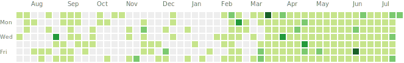

  

&nbsp;

&nbsp;

&nbsp;

&nbsp;

&nbsp;

 

<i>Just pushing some things that I build. 🚀</i>

 

---

## 🛠️ Tech Arsenal

**⚡ Languages & Frameworks**

**🤖 AI · ML · Data Science**

**☁️ Cloud & DevOps**

**🗄️ Databases & Analytics**

---

## 🌐 Deployed Projects & Demo Videos

<table>
  <tr>
    <td>
      <h4>🟢 <b>Deployed Projects</b></h4>
      <ul>
        <li>
          <b>🚀 Project Astraeus</b> 
          <a href="https://astraeus-frontend.onrender.com/">🔗 Hands-on Demo</a> 
          <i>AI-powered Mission Control System with digital-twin simulation, real-time monitoring, and intelligent decision support.</i>
        </li>
        <li>
          <b>❤️ DonorConnect</b> 
          <a href="https://bloodme-frontend.vercel.app/">🔗 Live Deployment</a> 
          <i>ML & DL powered real-time blood donor and recipient intelligent matching platform.</i>
        </li>
        <li>
          <b>🌐 Portfolio Website</b> 
          <a href="https://mukulprasad.netlify.app/">🔗 Visit Portfolio</a> 
          <i>Personal portfolio showcasing AI, ML, and full-stack development projects and research work.</i>
        </li>
        <li>
          <b>Hackathon Dashboard Website</b> 
          <a href="https://hackathon-dashboard-mukul.netlify.app/login">🔗 Hands-on Demo</a> 
          <i>Interactive platform for hackathon tracking, participant analysis, and real-time event management.</i>
        </li>
      </ul>
    </td>
    <td>
      <h4>🎬 <b>Demo Videos</b></h4>
      <ul>
        <li>
          <b>🚀 Project Astraeus</b> 
          <a href="https://youtu.be/HiNK79Ijav8">▶️ Watch Demo</a> 
          <i>AI-powered Mission Control System with digital-twin simulation, real-time monitoring, and intelligent decision support.</i>
        </li>
        <li>
          <b>🌾 KisaanMitra</b> 
          <a href="https://youtu.be/S1hz6yakK4Y">▶️ Watch Demo</a> 
          <i>Multi-Agent System for collective agricultural empowerment using AI, IoT, and MAS architecture.</i>
        </li>
        <li>
          <b>❤️ DonorConnect</b> 
          <a href="https://youtu.be/T3-CFJ__JWg">▶️ Watch Demo</a> 
          <i>ML & DL powered real-time blood donor and recipient intelligent matching system.</i>
        </li>
        <li>
          <b>✂️ ClipBait</b> 
          <a href="https://youtu.be/AgLqEC7HuPs">▶️ Watch Demo</a> 
          <i>AI-powered smart clipboard system for capturing and analyzing copied content intelligently.</i>
        </li>
        <li>
          <b>🧠 NovaPulse</b> 
          <a href="https://youtu.be/KDNrGJ994Cw">▶️ Watch Demo</a> 
          <i>Voice-powered multi-agent news intelligence system using Amazon Nova AI.</i>
        </li>
      </ul>
    </td>
  </tr>
</table>

---

## 🚀 Featured Projects

| 🧠 Project | 📄 Description |
| ------- | ----------- |
| [KisaanMitra 🌾](https://github.com/MUKUL-PRASAD-SIGH/KisaanMitra) | Multi-Agent System for collective agricultural intelligence — climate insights, autonomous irrigation, market intelligence, and financial inclusion for farmers. |
| [NovaPulse 🧠](https://github.com/MUKUL-PRASAD-SIGH/NovaPulse) | Voice-powered multi-agent news intelligence system using Amazon Nova AI for sentiment analysis, trend detection, and automated executive summaries. |
| [NEURACITY 🏙️](https://github.com/MUKUL-PRASAD-SIGH/NEURACITY) | Neural/ML toolkit for city modelling and visualization — traffic optimization, zoning intelligence, and urban simulation. |
| [VAAYA-PROJECT ✈️](https://github.com/MUKUL-PRASAD-SIGH/VAAYA-PROJECT) | Smart travel platform blending Google Maps + Reels discovery + gamified exploration quests for travelers and local earners. |
| [VoOTEX 🎙️](https://github.com/MUKUL-PRASAD-SIGH/VoOTEX) | Voice-to-text transcription pipeline with speaker diarization, noise handling, and post-processing intelligence. |
| [X-FORECAST 📈](https://github.com/MUKUL-PRASAD-SIGH/X-FORECAST) | Advanced time-series forecasting models and dashboards for demand prediction, analytics, and trend intelligence. |
| [finance-bud 💰](https://github.com/MUKUL-PRASAD-SIGH/finance-bud) | Intelligent personal finance manager with budgeting automation, expense analytics, and financial insights. |
| [GlamGlow ✨](https://github.com/MUKUL-PRASAD-SIGH/GlamGlow) | ML-powered beauty product recommendation engine for personalized skincare and product discovery. |
| [HealthCare-System-Dashboard 🏥](https://github.com/MUKUL-PRASAD-SIGH/HealthCare-System-Dashboard) | Real-time healthcare analytics dashboard powered by ML-driven insights and monitoring pipelines. |
| [URBAN-PLANNING 🌆](https://github.com/MUKUL-PRASAD-SIGH/URBAN-PLANNING) | AI-driven city planning models for infrastructure optimization and smart urban layout simulations. |
| [Clipbait ✂️](https://github.com/MUKUL-PRASAD-SIGH/Clipbait) | AI-powered smart clipboard system to capture, analyze, and understand copied content using ML & DL. |
| [DonorConnectT ❤️](https://github.com/MUKUL-PRASAD-SIGH/DonorConnectT) | ML & DL based real-time blood donor-recipient intelligent matching and healthcare support system. |
| [PROJECT_ENTANGLEMENT 🚀](https://github.com/MUKUL-PRASAD-SIGH/PROJECT_ENTANGLEMENT) | SIH 2025: Project Astraeus — AI-powered Mission Control with digital twin simulation and predictive system monitoring. |
| [Hackathon-Dashboard 📊](https://github.com/MUKUL-PRASAD-SIGH/Hackathon-Dashboard) | Real-time hackathon management dashboard for event tracking, analytics, and participant intelligence. |

> 🧠 These projects integrate **Machine Learning, Artificial Intelligence, Multi-Agent Systems, and Data Intelligence pipelines** — going beyond traditional software development into intelligent system engineering.

---

## 📊 GitHub Stats & Activity

&nbsp;

 

### 📈 Contribution Activity

 

### 💻 Top Languages

&nbsp;&nbsp;

 

### 🗺️ Contribution Heatmap

 

### 🐍 Contribution Snake

 

### 🏆 GitHub Trophies

 
<b>🔥 Code. Commit. Conquer.</b> 
<i>Consistency beats talent when talent doesn't commit.</i>

---

## 📫 Let's Connect!

&nbsp;

&nbsp;

&nbsp;

---

> *"Innovation is seeing what everybody has seen and thinking what nobody has thought."*
> — Dr. APJ Abdul Kalam

Thanks for stopping by! Feel free to check out my repositories or reach out for collaboration. 🚀

<!-- PULSE_START -->
> 🤖 **Auto-synced** · Last refreshed: `—` · Awaiting first run
<!-- PULSE_END -->

<!-- COMMITS_START -->
## Contribution stats

- All-time contributions (since 2008-01-01): **621**

### Contributions per month (last 12 months)

| Month | Contributions |
|---:|---:|
| 2025-04 | 0 |
| 2025-05 | 9 |
| 2025-06 | 9 |
| 2025-07 | 42 |
| 2025-08 | 73 |
| 2025-09 | 68 |
| 2025-10 | 48 |
| 2025-11 | 117 |
| 2025-12 | 60 |
| 2026-01 | 17 |
| 2026-02 | 137 |
| 2026-03 | 24 |
<!-- COMMITS_END -->

  

